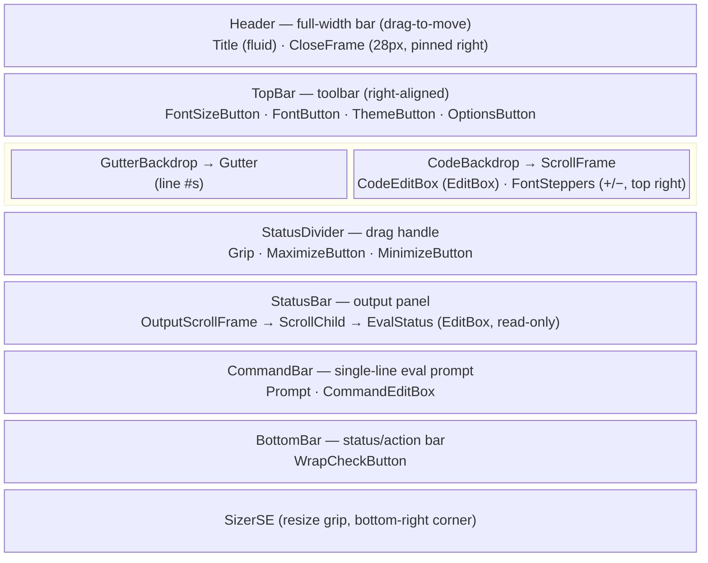

# CodeEditor

Standalone (non-Ace3) line-numbered code editor dialog prototype. Not wired into
the DevSuite namespace/module registry -- see [issue #90](https://github.com/kapresoft/wow-DevSuite/issues/90).

## Files

| File | Role |
|---|---|
| [`CodeEditorDialog.xml`](Modules/CodeEditor/CodeEditorDialog.xml) | Frame layout (`LDK_CodeEditorDialogTemplate`) |
| [`CodeEditorDialog.lua`](Modules/CodeEditor/CodeEditorDialog.lua) | `LDK_CodeEditorDialogMixin` -- gutter sync, wrap mode, font switching, eval |
| [`CodeEditBoxMixin.lua`](Modules/CodeEditor/CodeEditBoxMixin.lua) | Mixin for the `CodeEditBox` EditBox |
| [`MinimalScrollBarStyle.lua`](Modules/CodeEditor/MinimalScrollBarStyle.lua) | `ns.O.MinimalScrollBarStyle` -- restyles the code area scrollbar after MinimalScrollBar |

Fonts are not declared in this library.
[`FontUtil`](../LuaDevKit/Libs/Modules/FontUtil.lua) builds them at runtime with
`CreateFont`/`SetFont` from the `SharedMediaFontsMono` catalog -- one font object
per face per size in `FONT_SIZES` (10/12/14/16/18/20/24/28) -- and offers a face
only when it covers the client's locale, so a CJK client sees just its Noto Sans
Mono variant. `CodeEditorDialog.xml` declares one `LDK_CodeEditorFont` placeholder
so its FontStrings have a valid font at load time; `ApplyCodeFont()` replaces it
as soon as the dialog configures. The font files themselves are vendored under
`../LuaDevKit/ThirdParty/Libs/SharedMediaFontsMono/` (gitignored, so it is not
linked here), not under this library.

## Visual layout

The dialog is a fixed-header/footer frame with a scrollable body row in between,
and an output/eval stack sitting above the footer. Row order, top to bottom:



<details>
<summary>Plain-text fallback</summary>

```
+-----------------------------------------------------------+
|            Code Editor (Prototype)                   [X]  |  <- Header: Title (fluid) + CloseFrame (28px)
+-----------------------------------------------------------+
| TopBar                          [Size][Font][Theme][Opts] |  <- TopBar: font size/family, theme, options
+-----------------------------------------------------------+
| Gutter |  ScrollFrame                           [-][+]    |
| (line  |  CodeEditBox (EditBox)                           |  <- body: gutter + code area
|  #s)   |  (vertical scrollbar at right edge)              |
+-----------------------------------------------------------+
|                        ==========               [^][v]    |  <- StatusDivider: drag grip + max/min
+-----------------------------------------------------------+
| EvalStatus (output, selectable; appended run after run)   |  <- StatusBar: output panel
+-----------------------------------------------------------+
| > CommandEditBox                                          |  <- CommandBar: single-line eval prompt
+-----------------------------------------------------------+
| [x] Wrap                                                  |  <- BottomBar: status/action bar
+-----------------------------------------------------------+
                                          [SizerSE resize] ->
```

</details>

`Header` splits its width by anchoring rather than arithmetic: `CloseFrame` is a
fixed 28px pinned to the right, and `Title`'s `BOTTOMRIGHT` anchors to
`CloseFrame`'s `BOTTOMLEFT`, so the title absorbs whatever width is left at any
dialog size. `TopBar` anchors to `Header`'s bottom, making the header's height
the only place the header size is expressed. Only `Header` sets `enableMouse`
(for drag-to-move) -- `Title`/`CloseFrame` leave it off so a drag started
anywhere but the close button still reaches `Header`.

The bottom stack chains the same way, bottom-up: `BottomBar` pins to the dialog's
bottom edge, then `CommandBar`, `StatusBar`, and `StatusDivider` each anchor to
the top of the one below it. `GutterBackdrop`/`CodeBackdrop` then span from
`TopBar`'s bottom down to `StatusDivider`'s top, which leaves the code area as
the only row with no height of its own -- it absorbs whatever the fixed rows and
the user's chosen `StatusBar` height leave behind. `SetStatusHeight` clamps a
divider drag between `MIN_STATUS_HEIGHT` and `MaxStatusHeight()` (derived from
`MIN_CODE_HEIGHT`), so neither panel can be squeezed out of existence.

## Gutter / EditBox sync

The gutter (`Gutter`) and the code area (`ScrollFrame`) are two independent
`ScrollFrame`s. Three separate mechanisms keep their rows pixel-aligned,
all in `RefreshGutter()` and its scroll/size hooks:

1. **Same font, same pitch.** `Numbers` (the gutter's EditBox) and
   `CodeEditBox` always share one font object. `ApplyCodeFont()` is the only
   place either is set, and it calls `SetFontObject` on both -- plus the
   `WrapMeasure` string, the output panel, and the command bar -- in one pass.
   Since line height comes entirely from the font/text engine, rendering both
   columns' text in the identical font guarantees identical line pitch -- no
   per-line Y math is needed. This holds across font-size changes too: family
   and size together resolve to one font object via
   `FontUtil:FindFontChoice(family).bySize[size]`, so a size change is the
   same single-object swap as a family change.

2. **Same content height.** `RefreshGutter()` multiplies the rendered row
   count by `WrapMeasure.Text:GetLineHeight()` (an EditBox has no
   `GetStringHeight`), floors that at the viewport height, and applies it to
   *both* `child` (the gutter's ScrollChild) and `CodeEditBox`. Sizing both
   scroll children to the same content height gives their `ScrollFrame`s an
   identical scroll range, so a given scroll offset always corresponds to the
   same line in both. The gutter text is set *after* this, not before: the
   numbers EditBox lays out against whatever height it has at `SetText` time,
   so a layout committed against the old, shorter height stayed truncated even
   once the child grew underneath it.

3. **Locked scroll position.** The code `ScrollFrame`'s `OnVerticalScroll`
   handler (`OnCodeEditBoxScroll`) calls `self.Gutter:SetVerticalScroll(offset)`
   directly -- the gutter never scrolls on its own input; it only mirrors the
   code area's real `ScrollFrame` API, the same mechanism WoW uses for any
   scroll frame, so clipping behaves identically for both.

`RefreshGutter()` re-runs on every text change, viewport resize, wrap toggle,
font change, and programmatic `SetText` (`OnCodeEditBoxTextChanged`,
`OnCodeViewportSizeChanged`, `SetWrapText`, `ApplyCodeFont`, `SetText`), so the
three invariants above are re-established any time something could have
invalidated them.

Note the asymmetry in what triggers it. `RefreshGutter()` *writes* `CodeEditBox`'s
size, so reacting to that same box's `OnSizeChanged` would only ever be reacting
to our own writes -- a feedback edge with no external trigger behind it, which
looped every frame and (by constantly recalculating the caret) kept the text
cursor from ever rendering. That handler is deliberately not wired; only the
**ScrollFrame's** resize is, since `RefreshGutter()` never resizes the ScrollFrame.
For the same reason `OnCodeEditBoxTextChanged` bails when the text is unchanged,
and every setter inside `RefreshGutter()` is gated on `SizeDiffers` -- WoW
re-fires these events even when nothing actually changed.

**Wrap mode** adds a fourth piece: since one logical line can span multiple
*visual* rows once wrapped, `WrappedLineNumbersText()` uses the hidden
`WrapMeasure.Text` (same font and width as `CodeEditBox`) to ask
`GetNumLines()` how many visual rows each logical line will occupy, then
emits that line's number followed by `(rows - 1)` blank lines. This keeps the
gutter's row count matching the code's *visual* row count rather than its
logical line count, so numbers still land next to the correct wrapped text.

## Configuration

The dialog is designed to be usable as a future standalone library, before
any settings source (SavedVariables DB, AceConfig, etc.) exists. It never
reaches into one itself -- the host addon owns reading/writing settings and
just calls into these two methods:

- **`o:Configure(options)`** -- applies initial or programmatic settings.
  `options` is a partial table (`fontFamily`, `fontSize`, `wrapText`); any
  omitted field keeps its current value, merged over `DEFAULTS` on first
  call. Safe to call before or after `:Show()`. Does **not** fire
  `OnConfigChanged` -- the caller already knows what it just set.
- **`o:SetOnConfigChanged(callback)`** -- registers `callback(self, options)`,
  fired once per *user-driven* change (font dropdown pick, wrap checkbox
  click). `options` is always a **full snapshot** of `GetOptions()` --
  `fontFamily`, `fontSize`, and `wrapText` together, regardless of which one
  the user actually changed. Callers that persist settings can just do
  `DB.profile.codeEditor = options` with no merge logic of their own.

`fontFamily` is a stable key into `FontUtil:GetFontChoices()` (e.g.
`'UbuntuMono'`, the catalog face name with spaces and parens stripped),
independent of the dropdown's display label so relabeling a font later won't
break persisted config. `fontSize` is one of `FONT_SIZES`
(10/12/14/16/18/20/24/28) -- `FontUtil` builds one font object per family *per
size* rather than resizing at runtime, so any other value passed to
`Configure`/`SetFontSize` snaps to the nearest supported size
(`NearestFontSize`).

## Behavior notes

- **No-wrap mode** (default): `CodeEditBox` is fixed at 4000px wide, wider than
  the viewport, so lines never reach a wrap boundary.
- **Wrap mode**: `CodeEditBox` is pinned to the `ScrollFrame` width; the gutter
  emits a blank line per extra wrapped row so numbering stays visually aligned.
- **Fonts**: changing family or size routes through `ApplyCodeFont()`, which
  calls `SetFontObject` on `CodeEditBox`, `Gutter.ScrollChild.Numbers`,
  `WrapMeasure.Text`, `EvalStatus`, `CommandBar.Prompt`, and `CommandEditBox`
  together, since `inherits="..."` in XML only binds once at load. It also
  re-applies `EvalStatus`'s justification, which `SetFontObject` resets.
- **Output panel**: `EvalStatus` is a read-only multi-line `EditBox` in a plain
  `ScrollFrame` (`OutputScrollFrame`), not a `ScrollingMessageFrame`, since a
  `ScrollingMessageFrame` offers no way to select text. `RefreshOutput()`
  rewrites it from `outputLines` on every append, resize, and stray keystroke
  (the read-only guard in `OnEvalStatusTextChanged`). The panel has no
  scrollbar: the wheel scrolls it by `OUTPUT_SCROLL_LINES` rows, and
  `OnScrollRangeChanged` snaps back to the newest line whenever content or
  size changes.
- **Output panel, bottom alignment**: the box hangs off the bottom of
  `OutputScrollFrame.ScrollChild`, which `SyncOutputHeight()` floors at the
  viewport height, so short output still sits on the panel's bottom edge the
  way the old frame's `SetJustifyV('BOTTOM')` put it there. An `EditBox` sizes
  itself to its own text, so without that floor there is no blank space for
  vertical justification to act in.
- **Output panel, colors**: output keeps its `|cRRGGBBAA`/`|r` coloring, and a
  selection still pastes as plain text -- the client strips escape sequences
  when copying out of an `EditBox`, so the panel does not have to choose.
- **Font sizes**: `FontUtil` creates each catalog face at every size in
  `FONT_SIZES` (`CreateFont`/`SetFont`, named e.g.
  `LDK_CodeEditorFont_UbuntuMono_12`) and memoizes the set, so a size change is
  a font-object swap rather than a runtime resize.
- **Notify flag**: `SetCodeFont`/`SetFontSize`/`SetWrapText` take an optional
  `notify` argument -- `true` fires `OnConfigChanged` (used by the
  dropdown/checkbox handlers), omitted for internal/initial sets (`OnLoad`,
  `Configure`).

## Standalone library extraction

This prototype has proven out per #90's acceptance criteria (line numbers
stay correct with no-wrap, gutter sync holds up, font/size/wrap are
user-configurable). Next step: extract it into its own repo, mirroring
`LibIconPicker`'s structure (`LibStub:NewLibrary`, own `.toc`, `pkgmeta.yaml`,
`dev/deployer-config.lua`).

The final library covers two jobs, not just editing:

- **Edit or view code** -- everything this prototype already does (gutter,
  no-wrap/scroll, font/size/wrap switching)
- **Evaluate code** -- running the buffer's contents, the way the Debug
  Dialog's eval popup does today

Candidate names, evaluated on how well they signal *both* jobs rather than
reading as a plain text-editing widget:

1. **`LibCodeConsole`** (favored) -- "console" implies an edit-then-run loop
   (like a REPL or dev console), capturing edit *and* eval in one word
   without overpromising either way.
2. **`LibLuaConsole`** -- same framing as #1, names the language explicitly.
   Slightly narrows scope (Lua-only) but reads more concretely from a repo
   list.
3. **`LibCodeEditor`** -- the working name from #90. Accurate for edit/view,
   silent on eval; undersells the eval half given it's a first-class
   capability, not an add-on.
4. **`LibEvalPad`** -- "pad" implies a lightweight edit surface, "eval"
   front-loads the run capability. Shorter, more casual tone than the others.
5. **`LibDevPad`** -- generic dev-scratchpad framing, doesn't name "code" or
   "eval" specifically. Least descriptive, but most open-ended if scope grows
   beyond edit+eval later (e.g. FAIAP.lua-style syntax highlighting).